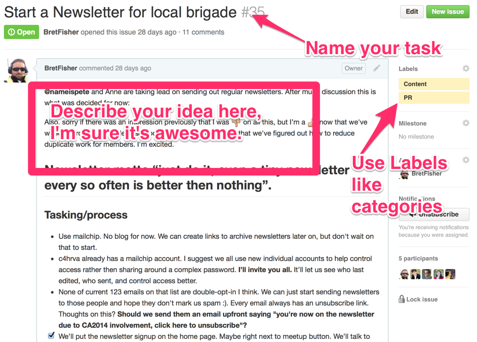

Tasks and Ideas
=====

This is a Running issue and idea list for our brigade

Use the Issues feature in GitHub (look on right) to create and manage tasks, like a running to-do list.

Use labels to indicate what kind of skills are needed for the task or idea, ex.: Coding, Design, Content, Operations

###Example

